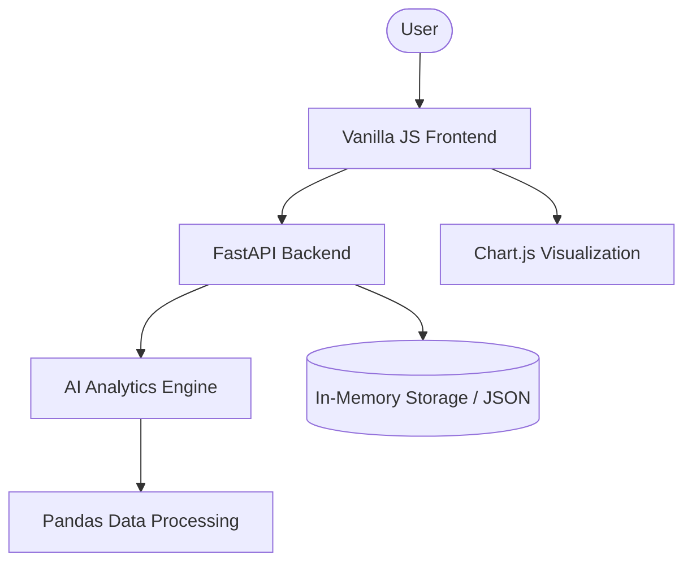

<div align="center">
  
  <h1>🧠 NeuroStudy</h1>
  <p><b>AI-Based Study Pattern Analysis and Support System</b></p>

  []()
  []()
  []()
  []()

  <p align="center">
    <i>Empowering students with AI-driven insights to master their study patterns and optimize academic performance.</i>
  </p>
</div>

---

## 📖 Table of Contents
- [Project Overview](#-project-overview)
- [Key Features](#-key-features)
- [Technical Stack](#-technical-stack)
- [System Architecture](#-system-architecture)
- [Installation & Setup](#-installation--setup)
- [Project Structure](#-project-structure)
- [UI/UX Design](#-uiux-design)
- [Team](#-team)
- [License](#-license)

---

## 🌟 Project Overview

**NeuroStudy** is a sophisticated EdTech platform designed to help students bridge the gap between effort and outcome. By tracking study sessions and analyzing focus levels, the system identifies peak productivity windows and generates optimized study roadmaps—all without relying on expensive external AI APIs.

### The Problem
70% of students struggle with time management. Traditional planners are static and don't account for individual concentration patterns or the "afternoon dip" in focus.

### Our Solution
NeuroStudy uses a rule-based AI engine to provide **personalized study intelligence**. It learns when you are most effective and suggests what to study and when, ensuring you tackle the hardest subjects when your brain is most ready.

---

## ✨ Key Features

### 1. 🧠 AI-Powered Analytics
- **Pattern Recognition**: Automatically identifies your peak productivity periods (Morning/Afternoon/Evening).
- **Smart Suggestions**: Provides context-aware advice (e.g., suggesting the Pomodoro technique if focus scores are low).
- **Performance Metrics**: Tracks cumulative study hours and average concentration levels.

### 2. 🗓️ Smart Roadmap Generator
- **Multi-step Wizard**: An intuitive 3-step interface to plan your day.
- **Intelligent Allocation**: Distributes subjects based on available time and focus levels.
- **Automated Breaks**: Smartly inserts 15-minute breaks to prevent burnout.

### 3. 📊 Interactive Dashboard
- **Visual Trends**: Real-time line charts showing focus level fluctuations.
- **Status Metrics**: At-a-glance view of your study health.
- **Timeline View**: Visual representation of your generated roadmap.

### 4. 🎨 Premium Experience
- **Glassmorphism UI**: Modern, sleek aesthetics with deep purple to pink gradients.
- **Responsive Navigation**: Smooth transitions between Dashboard, Logger, Insights, and Roadmap.

---

## 🛠️ Technical Stack

### **Backend**
- **FastAPI**: High-performance RESTful API framework.
- **Python (Pandas)**: Vectorized data processing for lightning-fast analytics.
- **Pydantic**: Robust data validation and settings management.
- **Uvicorn**: Lightning-fast ASGI server implementation.

### **Frontend**
- **Vanilla JS (ES6+)**: Zero-dependency frontend logic for speed and control.
- **CSS3 (Custom Properties)**: Advanced layout system using Flexbox, Grid, and Variables.
- **Chart.js**: Dynamic data visualization for study trends.
- **Google Fonts (Outfit)**: Premium typography for a modern look.

---

## 🏗️ System Architecture



---

## 🚀 Installation & Setup

### Prerequisites
- Python 3.8 or higher
- Modern Web Browser (Chrome, Firefox, Safari, Edge)

### 1. Backend Setup
```bash
# Navigate to backend directory
cd backend

# Create and activate virtual environment
python3 -m venv .venv
source .venv/bin/activate  # On Windows: .venv\Scripts\activate

# Install dependencies
pip install -r requirements.txt

# Start the server
uvicorn main:app --reload
```
The backend will be running at `http://localhost:8000`.

### 2. Frontend Setup
```bash
# Navigate to frontend directory
cd frontend

# Serve the files locally
python3 -m http.server 5173
```
Open `http://localhost:5173` in your browser.

---

## � Project Structure

```text
├── backend/
│   ├── main.py            # FastAPI application & endpoints
│   ├── requirements.txt   # Python dependencies
│   └── .venv/             # Virtual environment
├── frontend/
│   ├── index.html         # Main entry point
│   ├── index.css          # Design system & component styles
│   ├── index.js           # Frontend logic & API integration
│   └── assets/            # Images & Icons
├── PROJECT_DOCUMENTATION.md # Detailed technical report
└── README.md              # Project overview (this file)
```

---

## 🎨 UI/UX Design

NeuroStudy follows a **Premium Dark Aesthetic** design philosophy:
- **Color Palette**: Royal Purple (`#6366f1`) to Vibrant Pink (`#d946ef`) gradients.
- **Materiality**: Glassmorphism cards with subtle borders and deep shadows.
- **Typography**: The "Outfit" font family provides a clean, geometric feel that balances technology and elegance.
- **Micro-interactions**: 0.3s ease-in-out transitions on all interactive elements.

---

## 👥 Project Team

- **Aman Gupta** - Backend Architecture & AI Logic
- **Harsh** - Frontend Engineering & API Integration
- **Jatin** - UI/UX Design & Branding

---

## 📄 License

This project is licensed under the MIT License - see the [LICENSE](LICENSE) file for details.

---

<div align="center">
  <p>Made with ❤️ by the NeuroStudy Team</p>
  <p><b>Last Updated: February 25, 2026</b></p>
</div>
